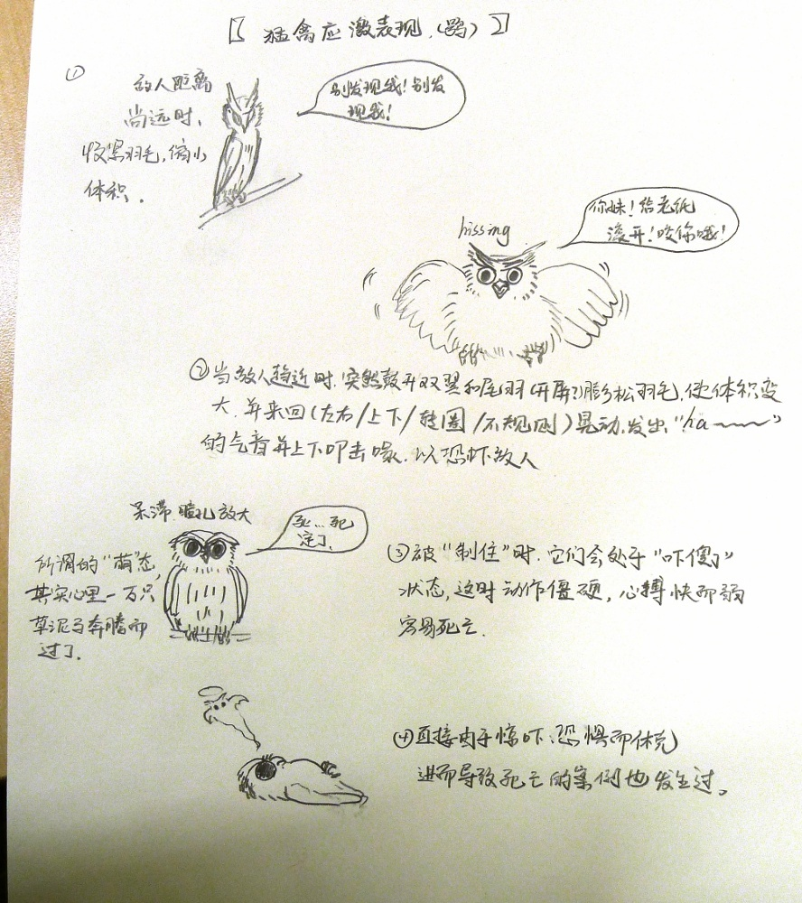

********************
猫头鹰救助和饲养指南
********************

:author: 百度猫头鹰吧[#baidu-owl]_

.. [#baidu-owl]
   http://tieba.baidu.com/f?ie=utf-8&kw=%E7%8C%AB%E5%A4%B4%E9%B9%B0

前言
====

简介
----

本文档旨在为中国的受众提供一个以猫头鹰的救助和饲养为主题的，
简洁但比较完备的自助指南。

本文档源自百度猫头鹰吧网友的共同努力。
欢迎转载， *转载时请注明作者、出处* 。

本文档托管于 GitHub 上[#github-link]_。

.. [#github-link]
   https://github.com/CasperVector/owl-guide

法律问题
--------

根据我国的现行规定，
*所有的鸮形目鸟类（即广义的猫头鹰，包括猴面鹰）都是国家二级保护动物* 。
法律规定：
“国家鼓励驯养繁殖野生动物。驯养繁殖国家重点保护野生动物的， *应当持有许可证* 。”
就目前的法律实践而言，国家原则上支持救助遇险的猫头鹰，
一般不支持也不反对救助后饲养猫头鹰，但严厉打击捕捉、交易和虐待猫头鹰的行为。

我可以救助猫头鹰吗
------------------

我们鼓励有条件的网友救助猫头鹰。
救助猫头鹰的门槛并不是很高，请参考后面几节的内容。
如果的确没有条件，那么不建议自行救助猫头鹰；
可以考虑向媒体、动物保护组织、动物园和林业局等单位求助，
也可以参考这个[#vigilance]_链接中“那如何救助猛禽呢？”一部分中列出的名单，
通过微博求助。

.. [#vigilance]
   http://www.guokr.com/post/444132/

我可以饲养猫头鹰吗
------------------

我们不反对有条件的网友饲养猫头鹰，
同时支持有充足条件且有这方面志向的网友研究猫头鹰的驯养和繁殖。
饲养猫头鹰至少需要满足下文所述的条件。
如果没有充分的条件，请在救助猫头鹰之后及时将其放生；
这样的情况下，在救助期间，请不要过于和猫头鹰亲近，
因为对人失去警戒心的猫头鹰容易被捕捉。

* **经验**

  至少应该有救助猫头鹰的经验（请参考后面几节的内容）。

* **精力**

  需要有充足的时间用于照顾猫头鹰（包括喂食、互动、处理粪便等）。

* **财力**

  要饲养猫头鹰，即使单论喂食，
  每月也至少需要花费几十元（小型猫头鹰）、上百元（中型猫头鹰），
  甚至几千到几万元（大型猫头鹰），
  具体请参考 `喂食 <#喂食>`__ 一节。

  除此之外，饲养猫头鹰还需要器具（例如中大型猫头鹰需要的鹰架、两开）、
  场地（放养所需）等，大型猫头鹰需要定期放风；
  猫头鹰生病时，还会有药品等的支出。

* **理解**

  *所有的猫头鹰都是猛禽* ，它们是纯肉食动物，而且需要定期吃活食。
  不能因为觉得这样残忍就不给它们提供活食，甚至让它们吃素。
  请牢记： *不要用人类的道德标准来要求动物* ；
  当然反之亦然，不要以动物的本能作为人性的标准。
  我们认为，
  只要饲养者不是为了通过虐待取乐而把活食喂给猫头鹰，
  而只是满足由自然规律所决定的猫头鹰的进食需要，
  这样的喂食行为应该就是可以理解的。

  猫头鹰和其它鸟类一样，因为生理构造的缘故，
  在需要排便时是无法憋住的，因此在放养时难免到处排便；
  而猫头鹰因为习性的缘故，又必须保证定期放养。
  因此， *一旦决定饲养猫头鹰，就必须做好处理其粪便的准备* 。
  关于猫头鹰粪便的处理，请参考“喂食”一节的 `粪便 <#粪便>`__ 部分。

  猫头鹰因为各种原因，身上难免带有令人不愉快的气味。
  因为猫头鹰需要吃活食，
  有的饲养者购买了小白鼠繁殖组来为猫头鹰提供食物，
  而小白鼠也是气味很大的生物。
  因此， *一旦决定饲养猫头鹰，就必须做好不怕脏不怕臭的准备* 。

* **恒心**

  人工饲养条件下猫头鹰的寿命可能达到十几年到几十年。
  *负责任的饲养者需要做到在宠物的一生中对其不离不弃* ，
  不能因为
  “搬家”“工作调动”“结婚后家人不喜欢宠物”“生孩子期间不宜接触动物”
  等原因而将其抛弃或轻率地转手[#abandon]_。
  养猫养狗如此，养猫头鹰更是如此。

  此外，猫头鹰的饲养难度远高于猫狗，且绝不亚于娇贵的大型鹦鹉，
  其中有很多技术问题尚未得到妥善解决。
  例如，包括猫头鹰在内的很多野生动物有所谓“反性”的现象[#alienation]_，
  类似于青少年的“逆反期”，
  即从小养大的动物在某个年龄段会对饲养者特别疏远，
  甚至造成饲养者的精神和财产损失。
  *负责任的饲养者需要做到无论宠物多么逆反，都不虐待或抛弃它* 。

  最后，就目前我国的状况而言，猫头鹰几乎是纯粹的野生动物。
  宠物猫头鹰的驯养和繁殖研究几乎没有，连“刚起步”都算不上。
  因此， *一旦决定饲养猫头鹰，就必须抱着对野生动物万分负责的态度* 。

.. [#abandon]
   很多宠物，例如大部分的家养大型鹦鹉，一生中都有过多个主人，
   这使它们中的许多患上抑郁症，痛苦终生。

.. [#alienation]
   这方面的一个悲剧性的例子：
   http://tieba.baidu.com/p/2397152048
   （请务必看完第 24 楼楼中楼的所有回复）。

居住
====

猫头鹰不宜笼养
--------------

无论什么体型的猫头鹰都不适合居住在狭小的笼子内。

猫头鹰是野性很强的鸟类，居住在狭小的空间中时爱扑腾。
如果养在小笼子里，则容易和笼壁的金属丝碰撞，轻则羽毛废掉，重则头破血流。
特别是有裸露的金属尖端的笼子（见附图），极易对猫头鹰造成严重的伤害。

   有裸露金属尖端（图中红色阴影部分）的笼子（原图引自 `这里`__ ）

__ http://tieba.baidu.com/p/2817053927

如果确实要笼养猫头鹰，
*请确保笼子的尺寸（棱长）至少为猫头鹰体长
（完全伸展状态下[#body-length]_，从嘴尖到尾尖，即包括尾长）的 4 倍* 。

.. [#body-length]
   专业的测量一般是将鸟麻醉之后，将其身体完全伸展再测量的；
   一般人只要目视估计一下即可，没有必要冒风险去实际测量其体长。

猫头鹰适合的居住条件
--------------------

各种体型猫头鹰适合的居住条件
............................

* 体型比鸽子还小的小型猫头鹰，建议养在尽量大（例如装洗衣机的）的纸箱里。

* 体型在鸽子和鸡之间的中型猫头鹰，建议养在“隼台”[#falcon-block]_上，
  可以在套“两开”在其脚上以免其乱飞（见附图）。

* 体型比鸡还要大的大型猫头鹰，建议腾出一整个房间放养。

   隼台和两开（图引自 `这里`__ ）

__ http://www.northwoodsfalconry.com/products-page/perches-for-falcons/
   middle-east-black-arab-falcon-block-pb132/

.. [#falcon-block] 隼台、两开等为鹰具，可在淘宝等网站上购买。

定期放养/放风
.............

对于小型和中型猫头鹰，最好每晚在室内放养，至少应保证定期放养；
白天一般是猫头鹰的休息时间，如上文所述，
可以箱养（对于小型猫头鹰）或架养（中型猫头鹰）。
建议在卫生间或封闭阳台等封闭空间放养，
以便每次放养结束之后的寻找和捕捉。
更多细节请参考 `放养的注意事项 <#放养的注意事项>`__ 一小节。

大型猫头鹰必须定期带到户外放风，其注意事项请参考 `互动 <#互动>`__ 一节。

提供站杠
........

通常猫头鹰在自然条件下，多数时候是站在树枝上面的，
由此进化出的生理构造决定了它们需要站杠，
否则容易得禽掌炎等病。

站杠应较粗（大概 3 到 4 个手指那样粗），表面粗糙，并缠上软布。
因为站杠会被猫头鹰的粪便等弄脏，建议定期清洁以保持其卫生，
降低猫头鹰生病的可能性。

大型猫头鹰关在较为狭窄的室内时，
其飞行范围受限，不容易飞高。
因此，最好把站杠设在比较低的地方；
或者从低到高设立几根站杠，可以充分利用空间。

其它重要提示
------------

喂水
....

在猫头鹰够得着的地方，
应该有一个不易被打翻的容器（例如狗食盆，见附图）用来装水，
其中的水用光或弄脏之后应当即使补充或更换。

.. figure:: img/dog-bowl.jpg

   不易被打翻的水盆（图引自 `这里`__ ）

__ https://commons.wikimedia.org/wiki/File:Dog_Water_Bowl.jpg

避光
....

多数猫头鹰是夜行的，长期暴露在阳光下会损伤其视力，也不利于其休息。
因此，在猫头鹰居住的地方，
需要保证在其活动范围之内总可以有一片避光的地方
（如果不能保证避光，那么至少应该避免阳光直射）。
例如，附图中的鸟舍就是一个没有很好考虑避光要求的例子。

不过猫头鹰也需要晒太阳，因此避光不能简单地理解为“黑暗条件”。
在猫头鹰居住的地方，最好同时能保证其活动范围之内，
在白天有一部分有自然光斜射。

   避光不足的鸟舍（原图引自 `这里`__ ）

__ http://tieba.baidu.com/p/2732523411

通风
....

有的箱子没有通风口（见附图），或者箱子比较深但通风口又在顶部，
猫头鹰呼出的二氧化碳沉积在箱子底部无法排出，容易引起其窒息。
如果只能使用这样的箱子来养猫头鹰，
那么必须在箱子侧面接近箱底的部分打一些通风口，
以免猫头鹰被闷死。

当然，除此之外，如果猫头鹰居住在室内的话，房间也应保持通风。

   通风不畅的箱子（图引自 `这里`__ ）

__ http://info.ryp.cn/detail/205034.html

安静
....

而且猫头鹰是野生动物，它们在陌生的环境下容易受惊，
例如在尚未和饲养者熟悉的情况下。
因此，猫头鹰居住的地方应该尽量避免过分吵闹。
类似地，即使是为了增进感情，饲养者也应该避免不必要地打扰猫头鹰。
关于和猫头鹰互动的正确方法，请参考 `互动 <#互动>`__ 一节。

温度
....

每种猫头鹰在自然条件下都有其能够承受的温度范围；
在人工环境中，活动区域受限的情况下，这个温度范围往往会缩小。
因此在人工环境中，
*遇到严寒或酷暑时，必须将猫头鹰移到气温更加合适的地方* ，
比如有暖气或空调的室内，而不只是冷天在鸟舍中垫干草、棉花。
关于这一点，请一定参考这篇[#temp-range]_网友文章。

.. [#temp-range] http://tieba.baidu.com/p/2783414111

放养的注意事项
--------------

和其它动物共处
..............

请牢记， *无论多么可爱的猫头鹰都是猛禽* 。
如果家中有可能被其攻击的其它动物，
例如体型小于猫头鹰，或体型和猫头鹰相仿但无法自卫的动物，
例如仓鼠、小鸡、小型鹦鹉，
以及八哥、鸽子（相对于大、中型猫头鹰而言）等，
请务必在放养猫头鹰时做好对这些动物的保护工作；
否则一旦酿成悲剧，没有后悔药可吃。

当然，中、小型猫头鹰也可能受到猫等动物的威胁；
一些动物尽管对猫头鹰没有恶意，
但在和猫头鹰玩耍时有可能在无意中伤到猫头鹰。
对于这些问题，饲养者同样需要注意。

家中物品的潜在威胁
..................

饲养者家中的门可能对放养的鸟造成严重乃至致命的伤害：
如果鸟站在门上，
而门又（因为风吹，或者人关门）突然关上，
则鸟可能被门夹伤甚至夹死。
这绝不是杞人忧天：真有人养的鸟被门夹死过，也有的鸟被门夹断了脚。
因此，在家中放养鸟时，需要小心关门，
并注意不要让门处于可以被风吹动的状态。

此外，插座等电力设备，电炉等加热器具，
较深的水缸等可能造成溺水的物品，
以及仙人球等有尖刺或锋利边缘的物品，
都可能构成对放养鸟的潜在威胁，
饲养者在放养前需要排除这些威胁。

喂食
====

猫头鹰的食物
------------

猫头鹰不可以吃的食物
....................

* **不易消化吸收的食物**

  *猫头鹰绝不能吃猪肉或其它肥肉* ，
  因为其中的脂肪酸不容易被猫头鹰等猛禽通常吸收，
  会引起心肌梗塞。
  很少的猪肉或肥肉就很可能导致猫头鹰迅速死亡[#pork-death]_。

  此外，牛肉也不是容易消化吸收的食物，
  因此 *猫头鹰不宜吃牛肉* ，
  特别是消化能力较弱的小型猫头鹰。

.. [#pork-death]
   一个疑似喂猪肉导致猫头鹰死亡的例子：
   http://tieba.baidu.com/p/2590872131 。

* **刺激消化系统的食物**

  *猫头鹰绝不能吃烹饪过的（咸的、辣的、油腻的，等等）肉类* ，
  因为其中的添加物会刺激
  包括猫头鹰的多数野生动物的消化系统[#cooked-meat]_，
  使猫头鹰生病。
  因此，这些食物绝对不能喂给猫头鹰。

.. [#cooked-meat]
   野生动物在自然环境下吃的基本都是生的食物，
   因此没有进化出适应盐、辣椒、味精等添加物的能力，
   也就无法承受这些物质的刺激。

* **容易产生尖刺的食物**

  *猫头鹰不能吃鱼虾等水产品* [#fish-death]_ [#fishing-owl]_，
  因为其尖刺或硬壳可能对猫头鹰的消化道和其它脏器产生致命的伤害；
  而且鱼虾作为高蛋白食物，不易被吸收。

  此外，尽管猫头鹰需要吃带骨的活食，
  但食物中若有很尖利的骨头或骨头碎片，
  则喂食前需要剔除这些尖利的部分。

.. [#fish-death]
   一个喂鱼虾导致猫头鹰死亡的例子：
   http://tieba.baidu.com/p/2767568330 。

.. [#fishing-owl]
   渔鸮类猫头鹰除外，因为它们经常以水产品为食，已经适应了吃水产品。

各种体型猫头鹰适合的食物
........................

* 体型比鸽子还小的小型猫头鹰以小虫为主食，
  建议喂面包虫、大麦虫、蝗虫、蟋蟀、蚕蛹等，也可以喂鸡鸭肉；
  除此之外，应该定期补充小白鼠、小鸡等小体型的活食。

* 体型在鸽子和鸡之间的中型猫头鹰以鼠类和小鸟为主食，
  建议喂小白鼠、大白鼠、小鸡等活食；
  切好的鸡鸭肉是有益的补充，但不能作为活食的替代品。

* 体型比鸡还要大的大型猫头鹰以比自身更小的鸟类为主食，
  建议给它们喂亚成年到成年的鸡等。

食物来源
........

面包虫、大麦虫、蝗虫、蟋蟀、蚕蛹等虫类可以在淘宝等网站上购买，
同时有一定可能也可以从花鸟市场买到。
*请特别注意不要买加入了防腐剂、调料或食用油的虫子* 。

小白鼠、大白鼠等鼠类也可以类似地在网上购买。
为了降低成本，建议购买“小白鼠繁殖组”，用剩饭剩菜喂养这些老鼠，
繁殖组中新生的小白鼠可以在长到一定阶段[#rat-size]_之后定期喂给猫头鹰。
*购买小白鼠繁殖组切勿贪心* ，
要有计划地喂新生鼠给猫头鹰，
保持老鼠数量在一个稳定的水平；
否则老鼠繁殖速度一旦超过控制，将引起鼠患。

如果捕捉得到的话，家鼠也可以喂给猫头鹰。
以家鼠作为猫头鹰的食物时， *需要格外小心鼠药问题* ，
疑似吃过鼠药的老鼠宁可扔掉也不能喂给猫头鹰。

.. [#rat-size]
   例如体型很小的猫头鹰适合吃比较小的老鼠，
   可以在新生鼠长到合适的大小之后喂给猫头鹰吃。

如何给猫头鹰喂食
----------------

补水
....

*猫头鹰到手之后的第一步应该是补水* ，
因为猫头鹰通常耐饿甚于耐渴，在缺水的条件下会很快死亡。
很多刚被救助的猫头鹰就是因为缺水而死。
因此，刚到手的猫头鹰应该首先补充水分，
可以用干净的毛笔蘸水涂在其嘴上；
之后，请参考“居住”一节的 `喂水 <#喂水>`__ 小节。

对于身体特别虚弱，难以自行进食的猫头鹰，
可以使用不带针头的注射器把水直接注入其口中。
在这种情况下，
需要注意的是喂水的总量和每一口喂水的量都要少，
避免胀到或呛到猫头鹰。

开食
....

* **何谓开食**

  猫头鹰等野生动物在进入陌生的环境后，
  可能因为恐惧而“拒食”。
  而如果受过惊吓、刺激，
  例如被人大力逮住、处于非常不舒服的姿势或者听到巨响，
  拒食的可能性会更大。

  和拒食现象相对应的，
  猫头鹰在进入陌生的环境后开始正常进食的现象就是“开食”。
  这一部分所介绍的，就是促进猫头鹰开食的一些经验，
  *以下方法请按顺序尝试* 。

* **准备工作**

  在入手之后， *尽量避免惊吓、刺激猫头鹰* ，
  可以降低猫头鹰拒食的可能性。

  猫头鹰是猛禽，
  因此猫头鹰喂的食物上有一些血腥味时，
  通常有利于激起猫头鹰的食欲，
  促进其开食。
  因此，为了促进猫头鹰开食，
  建议头几次喂食时喂一些带血的肉。

  猫头鹰不熟悉的活食在一定程度上有造成惊吓的可能，
  活食体型较大的活食尤其如此。
  因此，头几次给猫头鹰喂食时，如果喂活食，
  建议喂体型较小、较为安静、挣扎得不厉害的活食。

* **回避法**

  有时猫头鹰可能并不是完全不吃东西，
  只是在周围有人时感到恐惧。
  因此，如果猫头鹰当着人的面不吃东西，
  可以把食物放在它够得着的地方，
  然后人走开，一两小时之后再来看。

* **饥饿法**

  *此方法只适用于健康状况良好、饿得不厉害的猫头鹰！*

  回避一段时间之后，
  如果猫头鹰仍然没有吃东西，
  而且估计猫头鹰还能饿一段时间，
  可以继续等待一到两天。
  猫头鹰在明显地感到饥饿之后，
  可能就会开食。

* **填喂法**

  如果猫头鹰在饥饿状态下仍不开食，
  或（雏鸟，或因不佳的健康状况）难以自主进食，
  可能就需要采取填喂的措施。
  填喂的方法基本就是逮住猫头鹰，将食物塞进其嘴里，
  其中需要注意的主要有以下问题：

  - 在有效控制挣扎中的猫头鹰的前提下，
    逮住猫头鹰的动作应尽量轻柔，
    并使猫头鹰采取尽量自然的姿势；
    同时，往猫头鹰嘴里塞食物的动作也要轻柔。

  - 为了方便猫头鹰吞咽，
    建议将先润湿食物再喂。

  - 每一口喂的量要少，
    以免噎住猫头鹰。

  - 填喂时难以把握喂食的量，
    因此要特别注意喂每一口食物时猫头鹰的反应，
    一旦猫头鹰明显不愿进一步进食时应停止喂食。
    关于猫头鹰的食量，
    可以参考 `喂食方法 <#喂食方法>`__ 一小节。

  - 填喂是一种带有强迫性的行为，可能受到猫头鹰的反抗，
    因此喂食者需要注意对自身的保护。
    关于如何在填喂时保护自身，
    可以参考 `互动 <#互动>`__ 一节。

* **引逗法**

  猫头鹰可能不知道喂食者给它的东西是可以吃的，
  这时可以先少量填喂，等猫头鹰知道那是食物之后可能就会主动吃。

  有时，猫头鹰会主动啄食送到自己嘴边的食物，
  但却无视放在食盆里的同种食物。
  在这样的情况下，可以将食物送到猫头鹰嘴边，
  等它来啄时用食物引诱它移动到食盆边上，
  再等它啄时将食物放进食盆中，
  这样重复几次之后猫头鹰可能就学会主动从食盆里找食物了。

喂食方法
........

* **时间**

  成年猫头鹰建议每天早上或晚上喂食一次；
  雏鸟建议每 4 到 6 小时喂食一次。

* **食量**

  “一般来讲猛禽食量在体重的四分之一到五分之一”[#appetite]_；
  此外，雏鸟的食量相对于其体重的比例会更大。
  *建议每次喂到猫头鹰不再明显进食为止* 。

  *大型猫头鹰的食量非常大* ，例如雕鸮每天大约能吃掉一只成年鸡，
  光喂食的所需要的花费就是每月数千到数万元，
  因此做出饲养大型猫头鹰的决定必须万分慎重。

.. [#appetite]
   http://tieba.baidu.com/p/1392472171 （见第 14 楼）。

* **种类**

  只要条件允许， *请尽量保证猫头鹰的主食供应* 。
  在此基础上，
  在保证不喂 `猫头鹰不可以吃的食物 <#猫头鹰不可以吃的食物>`__ 的前提下，
  只要经济上负担得起，建议尽量使食物多样化。
  例如中型猫头鹰可以用小鸡、小白鼠、鸡鸭肉交替喂。

* **活食**

  小鸡、老鼠等活食会自己移动，喂食时可以把它们关在猫头鹰够得着的地方，
  让猫头鹰自行捕食，这样也有利于保持猫头鹰的自主生存能力。

  有的活食体型较大，在挣扎反抗时可能伤到猫头鹰，或者不便于被猫头鹰肢解。
  这样的情况下，建议将食物先切开之后再喂。

零碎事项
--------

营养补充剂
..........

就像人不应该挑食一样，
动物也不宜吃单一的食物。
通常而言，
人工环境下猫头鹰食物的多样性要比自然环境下的要低很多，
由此就产生了对营养补充剂的需求。

营养物质在生物体内的作用随着量的改变而改变，
缺乏和过量都可能引起病变。
因此，在补充营养的时候，要特别注意不能过度。

* **钙质**

  猫头鹰在缺乏钙质时，例如长期吃不带骨头的食物时，
  容易软骨病，表现为站立不稳等症状。
  为了预防和治疗猫头鹰缺钙，可以按一定计划采取补钙措施。
  注意： *补钙不是喂活食的替代措施* ，
  喂活食仍然是不可缺少的！

  为了补充钙质，
  可以将墨鱼骨[#squid-bone]_或鸡蛋壳磨成细粉，
  拌在猫头鹰的食物里；
  如果食物不容易吸附骨粉，
  可以先稍微用水润湿。
  量宜少，一周一两次，一次一小指甲盖那么多即可；
  若是治疗性质的补钙，频率可酌情增加。

  也可以使用市售的葡萄糖酸钙口服液，
  直接加到猫头鹰的饮水中即可。
  一周一两次，一次一支；
  若是治疗性质的补钙，频率可酌情增加。

.. [#squid-bone]
   墨鱼骨在药店、花鸟市场可能有卖，也可从淘宝等网站购买。

粪便
....

* **猫头鹰到处排便的缓解方法**

  如 `上文 <#我可以饲养猫头鹰吗>`__ 所述，
  包括猫头鹰在内的鸟类都存在着到处排便的问题。
  为了尽量缓解这个问题，可以采取以下一些措施：

  - 在喂食至少半个小时之后再把猫头鹰从箱子或鹰架上放出来。
  - 放养时，尽量少制造猫头鹰的潜在立足点（例如类似于站杠的东西），
    并在猫头鹰经常站立的地方下面垫上报纸等方便经常更换的材料。

* **观察粪便的技巧**

  鸟类的粪便可以提供关于其健康状况的重要信息。
  在清理之余，如果有心观察猫头鹰粪便，
  并学会根据粪便判断猫头鹰的健康状况，
  将可以为喂食和护理提供宝贵的参考。

  这方便有不少有价值的文章，
  例如可以从这篇[#dropping]_网友文章开始了解。

.. [#dropping]
   http://tieba.baidu.com/p/2337099979

食丸
....

猫头鹰等猛禽进食时通常是囫囵吞枣，
将食物连皮带骨头一块吞下。
其中营养物质被吸收之后，
较大块的未消化物质留在胃中结成团状，
积累到一定程度时从口中吐出，
这些团状的东西就是所谓的“食丸”（见附图）。

*食丸的形成是完全正常的现象* ，
无需特别担心。
事实上，对于生物学家而言，
食丸是判断猛禽进食状况的重要参考。
不过，在人工条件下，食物种类受限，
食丸的参考价值相对而言可能不那么高。

   猫头鹰的食丸（图引自 `这里`__ ）

__ http://www.owlpages.com/articles.php?
   section=owl+physiology&title=digestion

护理
====

猫头鹰的急救
------------

如果猫头鹰的状态非常差，
例如极度虚弱（几乎站不起来了）、严重外伤或者腹泻，
则需要采取急救措施，其中主要包括以下几项：

* **咨询兽医**

  如果有条件，
  *请尽量咨询（最好是擅长鸟类救助的）兽医* 。

* **外部护理**

  如果猫头鹰存在断肢（折翅、断脚等）的情况，
  可以考虑对折断处进行适当的固定。
  不要包扎得太厉害，以免影响正常肢体工作；
  一般猛禽类恢复能力较强，适当固定之后康复的可能性还是很大的。

* **药物治疗**

  请参考 `猫头鹰常用药品 <#猫头鹰常用药品>`__ 一小节，
  对症治疗。
  某些粉末状的内服药物可能需要拌在食物里喂食，
  而某些食物可能不易吸附粉末，此时可以先稍微用水润湿食物再混合。

* **进行静养**

  请参考 `猫头鹰适合的居住条件 <#猫头鹰适合的居住条件>`__ 部分，
  务必给猫头鹰的静养创造一个尽量好的条件。

* **考虑停食**

  如果猫头鹰吃了硬物等不该吃的东西，损坏了消化道，
  导致便血等症状，可能需要停食到症状好转为止，
  以免食物对消化系统造成额外的负担。
  停食期间，应通过饮水加强补充葡萄糖、电解质、维生素等，
  请参考 `猫头鹰常用药品 <#猫头鹰常用药品>`__ 一小节。

* **定期观察**

  应当增加观察的频率，
  以及时发现猫头鹰的异常状况，并对其作出应有的处置。
  当然，观察的时候要尽量避免惊吓到猫头鹰。

* **保护自己**

  固定断肢、上外用药等的时候，猫头鹰难免感到疼痛，
  同时它可能并不知道人类正在救助它，
  于是可能会有反抗行为，
  因此救助者需要注意对自身的保护。
  关于在救护猫头鹰时如何保护自身，可以参考 `互动 <#互动>`__ 一节。

猫头鹰常用药品
--------------

* **葡萄糖、电解质、维生素等**

  猫头鹰在极度虚弱或腹泻等状态下，
  需要紧急补充葡萄糖、电解质、维生素等营养物质，
  以满足最基本的生理需要。
  为了补充这些营养物质，
  最为方便的方法是购买“脉动”“佳得乐”等功能饮料，
  并将其作为饮水喂给猫头鹰。
  关于补水的具体操作，
  请参考 `补水 <#补水>`__ 一小节。

* **外用药**

  如果有出血的地方可以先用碘酒或碘伏消毒，等干燥之后再涂上云南白药；
  如果有断肢的情况，可以先上药再固定。
  注意：
  *云南白药要用粉剂，不要用气雾剂* 。

* **消炎药**

  猫头鹰受伤或生病时，可以在食物中加入少量土霉素等广谱消炎药。

* **助消化药物**

  腹泻时，为了帮助消化，
  可以尝试在食物中加入少量磨碎的乳酸菌素片，
  或其它类似药物。

猫头鹰自残如何处理
------------------

猫头鹰在有外伤时，可能会有抓挠伤口、撕扯羽毛等行为，
这些行为会干扰人类对猫头鹰的治疗措施。
在这样的情况下，
可以使用“伊丽莎白项圈”[#elizabethan-collar]_（见附图）
阻止猫头鹰对自己伤口的破坏。

   伊丽莎白项圈（图引自 `这里`__ ）

__ http://queen516zz.pixnet.net/blog/post/30652244

.. [#elizabethan-collar]
   伊丽莎白项圈可以自制，网上有很多教程；
   也可以在花鸟市场或淘宝等网站购买。

给猫头鹰佩戴伊丽莎白项圈时，
应注意：

* **不能影响呼吸和脖子转动**

  市售的项圈通常不会出这种低级错误；
  但自制的项圈有可能过紧，
  影响猫头鹰呼吸和脖子转动。
  总之，应注意项圈不能太紧。

* **不能影响猫头鹰饮食**

  过大的项圈可能和地面、箱壁等冲撞，
  导致猫头鹰的嘴无法靠近水和食物，
  从而使猫头鹰无法喝水和进食，
  这是很危险的。
  因此，猫头鹰的项圈大小必须仔细调整，
  防止猫头鹰因为项圈而渴死或饿死。

* **不应影响猫头鹰飞行**

  建议使项圈的开口朝向猫头鹰的头部而非尾部，
  这样便不会妨碍猫头鹰的翅膀展开，
  从而利于猫头鹰的飞行。

* **应有效阻止破坏伤口**

  在以上两条的前提下，
  项圈应该尽量有效地阻止猫头鹰抓挠伤口、撕扯羽毛。

如何为猫头鹰洗澡
----------------

洗澡的方法
..........

* **让猫头鹰自行洗澡**

  很多猫头鹰有洗澡的本能，
  在看见大小合适的装水容器时就可能主动跳进去洗澡。
  在这种情况下，
  饲养者只需准备好洗澡用的澡盆（当然，大小需要根据猫头鹰的体型而定），
  放在猫头鹰的放养处，任它自行洗澡即可。

* **手工给猫头鹰洗澡**

  如果猫头鹰不主动洗澡[#bath-reluctance]_，
  而又的确万分需要洗澡时，
  可以用喷雾器喷水在其身上，
  猫头鹰出于本能会通过抖动羽毛甩水。
  重复喷淋、甩干几次，
  便可以起到洗澡的效果。

.. [#bath-reluctance]
   遇到这种情况时，很有可能猫头鹰并不是不会主动洗澡，
   而只是因为各种原因不愿意主动洗澡。

洗澡的注意事项
..............

* **注意温度**

  洗澡时最大的隐患是感冒，而感冒对动物是可以轻易致命的威胁，
  因此猫头鹰洗澡时要特别注意温度，避免感冒。
  猫头鹰洗澡时的温度不应过于冷或过于热，以免冻着或烫着猫头鹰。
  水温应在 25 到 35 摄氏度之间，建议采用稍低于人体温的温度。

  洗澡后也要做好猫头鹰的保温工作，
  至少要保证其羽毛未干前始终处于较为适宜的温度之下，
  且不会发生气温的突变。
  例如在猫头鹰洗澡后，不要将其放在被阳光直射的阳台上，
  因为直射时可能比较温暖，但直射的时间过去之后温度可能突然降低，
  猫头鹰（特别是毛发未干的）很有可能感冒。

  保温措施难以实现时（例如在寒冷的冬天），建议推迟洗澡计划。

* **当心溺水**

  猫头鹰不是水鸟，在羽毛打湿之后往往难以飞行，
  因此在较深的澡盆里有溺水的风险。
  所以猫头鹰洗澡时，澡盆中不要放太多的水，
  建议水量以没过猫头鹰半身为宜。

* **不要使用电吹风**

  电吹风噪音大，很多野生动物会被其吓到。
  因此猫头鹰洗澡后不要用电吹风吹，建议自然晾干或风干。
  如果猫头鹰不怕饲养者的话，可以考虑用布擦干。

猫头鹰的指甲和羽毛剪不得
------------------------

猫头鹰是以其它动物为食的猛禽，尖爪是它们的主要武器；
对任何的飞禽而言，羽毛都是如同人类的手足一样重要的部分。
因此，剪去猫头鹰的指甲和羽毛，
就如同砍掉人的手足一样，是绝对不可以的。

猫头鹰的指甲不能剪，但和猫头鹰互动时可以带护具以免被抓伤；
猫头鹰的羽毛不能剪，
同时我们鼓励将有自主生存能力的猫头鹰在条件合适时放生，
把本就属于它们的天空还给它们。

互动
====

猫头鹰的警戒行为和应激反应
--------------------------

应当明确的是，类似的动作和表情，
对动物的含义和对人类的含义没有必然联系，
对于不同的两种动物的含义也可能并不相同。
*被人类看作“可爱”的行为对动物可能完全是另外的含义，
而对一种动物象征着友善的行为对于另一种动物可能象征着强烈的敌意。*

例如，附图中“可爱”的猫头鹰事实上正处于极度恐惧中：
对于猫狗而言很舒服的的抚摸，反而加剧了猫头鹰的恐惧。
关于猫头鹰的警戒行为和应激反应，可以参考附图中的总结，
以及这篇[#vigilance]_网友文章。

   处于恐惧状态下的猫头鹰（原图引自 `这里`__ ）

__ http://imgur.com/gallery/jZZWD

.. raw:: latex

   \begingroup
   \adjustboxset*{width = 0.95\textwidth}

   猫头鹰的警戒行为和应激反应（图引自 `这里`__ ）

__ http://www.guokr.com/post/444132/

.. raw:: latex

   \endgroup

如何和猫头鹰增进感情？
----------------------

首先，如 `我可以饲养猫头鹰吗 <#我可以饲养猫头鹰吗>`__ 中所述，
如果没有万分充足的条件，不建议饲养猫头鹰，同时也不要和猫头鹰过分亲近。
因此，在试图培养和猫头鹰的感情之前，
请认真考虑自己是否确实负担得起饲养猫头鹰的责任。

如果猫头鹰没有明显地处于应激状态，
且已经开食（参考 `开食 <#开食>`__ 部分），
可以尝试在喂食时小心并轻柔地抚摸猫头鹰的头顶，
可能可以起到增进感情的作用。
除了喂食时间以外，最好不要故意打扰猫头鹰，
即使主观上是为了增进感情也不要。

猫头鹰如何上手？
----------------

首先同上一小节所述，
在进一步互动之前请尽量保证自己对饲养猫头鹰有充足的准备。
其次，猫头鹰上手与否，取决于猫头鹰和饲养者的默契，
以及一些运气性质的因素；
如果条件不成熟，请不要强求让猫头鹰上手，
更不要为了达成目的而对猫头鹰采取虐待性质的驯化政策。

在饲养者和猫头鹰充分熟悉之后，可以考虑培养猫头鹰上手、上肩等。
其基本方法是食物引诱（参考 `开食 <#开食>`__ 部分中的“引逗法”），
并以食物、抚摸（当然，前提是猫头鹰不反感被抚摸）等手段进行激励。

被猫头鹰抓/咬伤怎么办？
-----------------------

猫头鹰的尖爪不像猫狗一样可以缩回肉垫里，
因此即使猫头鹰已经和人相当默契，其爪子仍然可能伤人。
`上文 <#猫头鹰的指甲和羽毛剪不得>`__ 已经强调过，
猫头鹰的指甲不能剪，但饲养者可以采取防护措施来尽量避免抓伤：

* 在让猫头鹰上手前，佩戴皮手套或胶手套，并穿较厚的长袖外衣，
  以减少身体裸露部分的面积。

* 在让猫头鹰上肩时，采取措施防止其往头上钻，以免头部被抓伤。

* 设法让猫头鹰知道，放风时不要随意往他人身上站，以免抓伤他人。

很多猫头鹰在野外以老鼠等为主食，因此其身上可能携带鼠疫等疾病的病原体。
万一被猫头鹰抓/咬伤之后，建议采取以下措施：

* 用干净的清水洗净伤口。

* 建议至少用香皂洗涤伤口，最好用酒精等对伤口进行消毒。

* 如果条件满足，建议咨询有相关经验的医生。

和猫头鹰互动的其它风险？
------------------------

猫头鹰可能携带禽流感等疾病的病原体，而这些疾病可能不需要抓/咬伤便可传播。
在禽流感等传染病的高发季节，这种风险会更加严重。
为了防范这些风险，可以采取以下这些措施：

* 不要轻易接触野生猫头鹰。

* 不要让已经家养比较久的猫头鹰接触来源不明的动物，
  而投喂的活食也要注意来源是否安全。

* 注意卫生，加强消毒。

* 一旦发现可疑症状，立即向医院和相关主管单位报告。

放生
====

