**************
猫头鹰分类指南
**************

:author: 百度猫头鹰吧[#baidu-owl]_

.. [#baidu-owl]
   http://tieba.baidu.com/f?ie=utf-8&kw=%E7%8C%AB%E5%A4%B4%E9%B9%B0

前言
====

简介
----

本文档旨在为中国的受众提供一个关于猫头鹰分类的、
以简洁和便于自助为目标的入门指南。

考虑到本文档的入门性质，本文档着重介绍生活中常见或著名的猫头鹰物种。
考虑到受众的范围，本文档主要介绍国内的猫头鹰物种，
但也介绍一些经常被提及和问到的非本土物种。

本文档源自百度猫头鹰吧网友的共同努力。
欢迎转载， *转载时请注明作者、出处* 。

本文档托管于 GitHub 上[#github-link]_。

.. [#github-link]
   https://github.com/CasperVector/owl-guide

分类概况
--------

本文档中的物种分法主要参考维基百科、
百度百科和《中国鸟类野外手册》[#cn-bird-guide]_。

.. [#cn-bird-guide]
   http://www.cnbird.org.cn/shouce/c.asp.htm

在生物分类学中，
猛禽类包括隼形目（鹰类）和鸮形目（广义的猫头鹰）的鸟类，
而鸮形目动物包括鸱鸮科（狭义的猫头鹰）和草鸮科（猴面鹰）两类。

猫头鹰在全世界范围内大约[#approx-species]_有 140 种，
其中在我国大约有 30 种（斜体西文为分类单位的拉丁文名）：

.. [#approx-species]
   种类数量的不确定性主要来源于物种分类和分布的相对模糊性。

- **草鸮科 *Tytonidae* ：**

  * **栗鸮属 *Phodilus* ：**
    栗鸮 *Phodilus badius* 。

  * **草鸮属 *Tyto* ：**
    草鸮 *Tyto longimembris* ，仓鸮 *Tyto alba* 。

- **鸱鸮科 *Strigidae* ：**

  * **角鸮属 *Otus* ：**
    东方角鸮 *Otus sunia* 、（西）红角鸮 *Otus scops* 、
    黄嘴角鸮 *Otus spilocephalus* 、领角鸮 *Otus bakkamoena* 、
    纵纹角鸮 *Otus brucei* 、琉球角鸮 *Otus elegans* 。

  * **鸺鹠属 *Glaucidium* ：**
    斑头鸺鹠 *Glaucidium cuculoides*  、花头鸺鹠 *Glaucidium passerinum* 、
    领鸺鹠 *Glaucidium brodiei* 。

  * **小鸮属 *Athene* ：**
    纵纹腹小鸮 *Athene noctua* 、横斑腹小鸮 *Athene brama* 。

  * **鹰鸮属 *Ninox* ：**
    鹰鸮 *Ninox scutulata* 。

  * **鬼鸮属 *Aegolius* ：**
    鬼鸮 *Aegolius funereus* 。

  * **耳鸮属 *Asio* ：**
    长耳鸮 *Asio otus* 、短耳鸮 *Asio flammeus* 。

  * **林鸮属 *Strix* ：**
    灰林鸮 *Strix aluco* 、褐林鸮 *Strix leptogrammica* 、
    长尾林鸮 *Strix uralensis* 、四川林鸮 *Strix davidi* 、
    乌林鸮 *Strix nebulosa* 。

  * **猛鸮属 *Surnia* ：**
    猛鸮 *Surnia ulula* 。

  * **雕鸮属 *Bubo* ：**
    雕鸮 *Bubo bubo* 、乌雕鸮 *Bubo coromandus* 、林雕鸮 *Bubo nipalensis* 。

  * **雪鸮属 *Nyctea* （现已并入雕鸮属）：**
    雪鸮 *Bubo scandiacus* 。

  * **渔鸮属 *Ketupa* （现已并入雕鸮属）：**
    褐渔鸮 *Bubo zeylonensis* 、
    黄腿渔鸮 *Bubo flavipes* 、
    毛腿渔鸮 *Bubo blakistoni* 。

本文档将顺带介绍一些经常被提及和问到的非本土物种：

- **鸱鸮科 *Strigidae* ：**

  * **白脸鸮属 *Ptilopsis* ：**
    （北）白脸角鸮 *Ptilopsis leucotis* 、南白脸角鸮 *Ptilopsis granti* 。

  * **小鸮属 *Athene* ：**
    穴（小）鸮 *Athene cunicularia* 。

  * **鬼鸮属 *Aegolius* ：**
    棕榈鬼鸮 *Aegolius acadicus* 。

  * **雕鸮属 *Bubo* ：**
    大角鸮 *Bubo virginianus* 。

分类方法概述
------------

因为是入门文档，
所以本文档采用较为符合非专业人士直觉的方式介绍分类的方法。
对于从照片中便可明显分辨的不同猫头鹰物种的形态区别不再进行阐述，
同时避免过多使用专有名词。

本文档将首先通过体型对猫头鹰进行一个粗浅的分类，
然后将每种体型的猫头鹰按形态分成若干类，
最后对各类中不同物种的具体区别进行介绍。

每种猫头鹰的雏鸟、幼鸟和成鸟的形态之间可能有巨大的差别。
因为是入门文档，且文档作者经验有限，
所以本文档只介绍成年猫头鹰的分类。

最后，作为最基本的进阶内容，
本文档也会提到通过一些非形态学的依据，
例如叫声、繁殖期等判断分类的方法作为参考。

值得注意的细节
--------------

猫头鹰在觉得安全遇到威胁时，可能表现出不同于平时的形态（见附图）：
有耳状羽的猫头鹰在防御状态下普遍会竖起耳状羽，
特别是角鸮类同时还会有其它的一些比较明显的形态变化。
这些变化在一定程度上可能干扰对猫头鹰种类的判断，
因此需要提请注意。

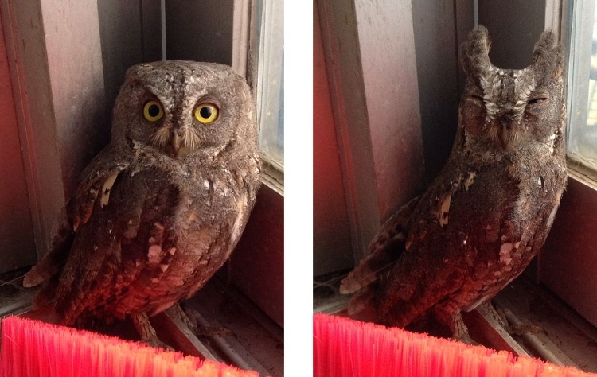

   左、右分别为正常状态和防御状态下的东方角鸮（图引自 `这里`__ ）

__ http://tieba.baidu.com/p/2724153583

如果给动物摄影时使用了闪光灯，那么在一定情况下可能发生“红眼”现象（见附图），
其原因是动物眼珠对灯光的折射。
给猫头鹰照相时同样可能发生这种现象，因此在观察照片时要注意辨别。

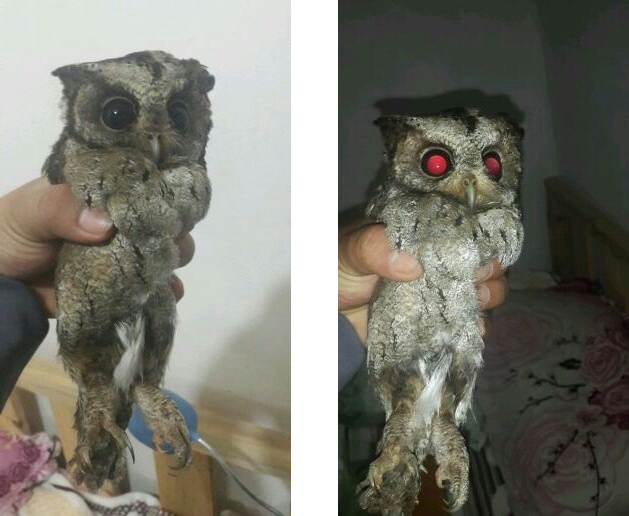

   摄影时的“红眼”现象（图引自 `这里`__ ）

__ http://tieba.baidu.com/p/2941887428

猴面鹰
======

目前确定在我国有野生分布的草鸮科猫头鹰（即猴面鹰），
按在我国的常见程度排序，依次为草鸮、仓鸮和栗鸮（见附图）。
这三种猴面鹰均为中小型猫头鹰，其中草鸮和仓鸮的平均体长约为 35 厘米，
而栗鸮的平均体长约为 27 厘米。

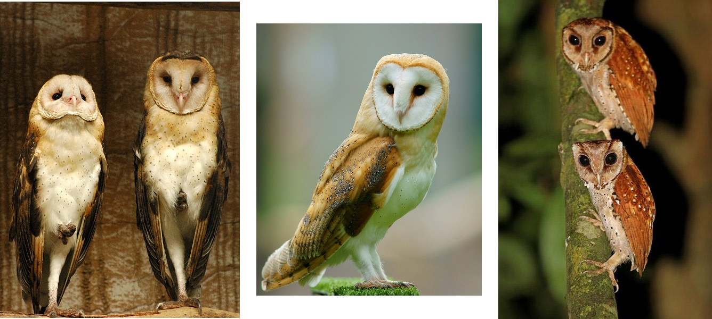

   从左到右依次为草鸮、仓鸮和栗鸮
   （图分别引自 `这里`__ 、 `这里`__ 和 `这里`__ ）

__ http://25.media.tumblr.com/742e0fefb0b25f25070c442cfc39a881/
   tumblr_mi2di24FAD1qigj88o1_1280.jpg

__ https://en.wikipedia.org/wiki/
   File:Tyto_alba_-British_Wildlife_Centre,_Surrey,_England-8a_%281%29.jpg

__ http://ibc.lynxeds.com/photo/
   oriental-bay-owl-phodilus-badius/two-birds-perched-trunk-night

栗鸮的形态和另外两种猴面鹰有着明显的不同，故不再赘述。
草鸮和仓鸮在形态上最大的区别在于两者从背部到头顶羽毛的颜色：
草鸮是黑底色带黄色图案，黑色是主要的；仓鸮是橙底色带黑色图案，橙色是主要的。

草鸮和仓鸮主要以鼠类为食；若要饲养，建议以喂大/小白鼠为主。
栗鸮食性更杂，虫子、鼠类均是其主食；
若要饲养，建议以白鼠以及蝗虫、蟋蟀等较大的虫类交替投喂。

小型猫头鹰
==========

角鸮类
------

常见种类
........

目前确定在我国有野生分布的角鸮中，
最常见的有领角鸮、东方角鸮和黄嘴角鸮（见附图），
其中领角鸮的平均体长约为 25 厘米，
而东方角鸮和黄嘴角鸮的平均体长约为 18 厘米。

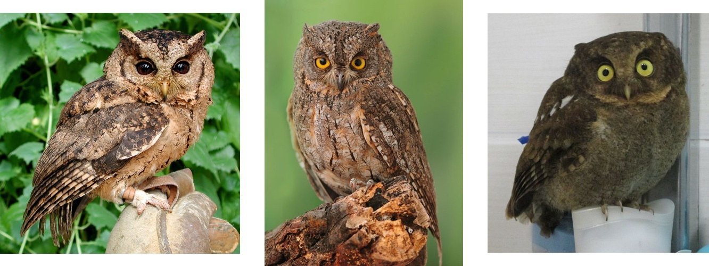

   从左到右依次为领角鸮、东方角鸮和黄嘴角鸮
   （图分别引自 `这里`__ 、 `这里`__ 和 `这里`__ ）

__ http://www.aerien.ch/oiseaux/Asie/STRIGIFORMES/STRIGIDAE/Otus_bakkamoena.php

__ http://www.birdnet.cn/thread-739470-1-1.html

__ http://tieba.baidu.com/p/2731146972

领角鸮的虹膜（即“眼白”，下同）为红色到深褐色（由此和东方角鸮、黄嘴角鸮区分），
喙（即嘴，下同）为带蜡状质感的黄色和/或深灰色。
其腹部有较为明显的纵纹，面部羽毛颜色和腹部相近，
后颈有浅色的“领”状羽，这是其中文名的来源。

东方角鸮的虹膜为黄色，
喙为类似于焦炭一样质感的深灰色到黑色（由此和黄嘴角鸮区分）。
其腹部也有纵纹，但羽毛的整体颜色比领角鸮的更深；
面部羽毛的颜色、图案和背部相近。
东方角鸮分两种色型：灰色型和棕色型。

黄嘴角鸮的虹膜为黄色，喙为黄色。
其瞳孔较小，因此“表情”显得较为“呆滞”。
其腹部花纹是较为细密的横纹。

东方角鸮和黄嘴角鸮以虫类和小老鼠为主食；
若要饲养，建议以喂面包虫等小虫和蝗虫等较大的虫类混合投喂，
有条件时可定期补充幼鼠作为活食。
领角鸮以虫类和鼠类为主食；
若要饲养，建议以白鼠以及蝗虫、蟋蟀等较大的虫类交替投喂。

其它种类
........

西红角鸮、琉球角鸮（又名兰屿角鸮）形态和东方角鸮非常相似，但叫声不同。
多数生物学家将琉球角鸮作为西红角鸮的亚种，
同时也有不少生物学家建议将东方角鸮作为西红角鸮的亚种。
纵纹角鸮（见附图）在我国罕见，外形和东方角鸮也很相似。

顺便提到，对不同的生物学家而言，
“红角鸮”这个名称可能指东方角鸮、西红角鸮或两者皆是，
因此具有较大的歧义，本文档不主张采用。

白脸鸮属的白脸角鸮（见附图）产于非洲，在中国没有野生分布，
但因在互联网上走红而颇有知名度。
近来有生物学家将白脸角鸮分为北白脸角鸮和南白脸角鸮两个物种。

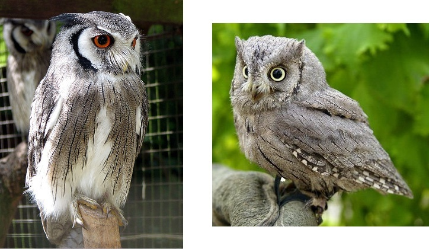

   左、右分别为白脸角鸮和纵纹角鸮（图分别引自 `这里`__ 和 `这里`__ ）

__ https://en.wikipedia.org/wiki/File:Northern_white-faced_owl_arp.jpg

__ http://wowturkey.com/forum/viewtopic.php?t=32800

鸺鹠属和小鸮属
--------------

鸺鹠属
......

目前确定在我国有野生分布的鸺鹠有斑头鸺鹠、花头鸺鹠和领鸺鹠（见两附图），
三者的平均体长分别约为 24、18 和 16 厘米，领鸺鹠是我国体型最小的猫头鹰。
三者中，斑头鸺鹠在我国最为常见，领鸺鹠次之，而花头鸺鹠在我国罕见。

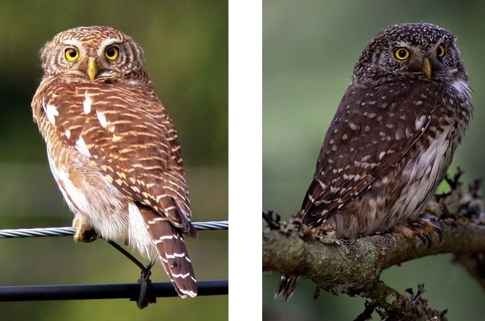

   左、右分别为斑头鸺鹠和花头鸺鹠（图分别引自 `这里`__ 和 `这里`__ ）

__ http://tieba.baidu.com/p/694809590

__ http://www.pbase.com/breider/image/135508661

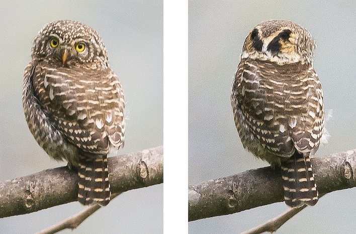

   领鸺鹠及其头部背面的 V 字图案（图引自 `这里`__ ）

__ http://orientalbirdimages.org/search.php?Bird_ID=635&Bird_Image_ID=92674

通过头顶和背部羽毛形成的图案，可以方便地区分这三种鸺鹠：
斑头鸺鹠的头顶和背部均为横纹，花头鸺鹠的头顶和背部均为点状斑；
领鸺鹠的头顶为点状斑，背部为横纹，且头部的背面有明显的 V 字形图案（见附图）。
以上方法只适用于完全成年的鸺鹠，
因为鸺鹠幼鸟的羽毛花纹在发育的过程中会发生一些明显改变。

鸺鹠以虫类、鼠类和小鸟为主食；
若要饲养，建议以白鼠和虫类交替投喂。
花头鸺鹠在我国罕见，发现后请尽量及时联系有关社会力量，以进行专业救助。

小鸮属
......

目前确定在我国有野生分布的小鸮有纵纹腹小鸮和横斑腹小鸮，
其中前者较常见，而后者罕见；
穴鸮产于美洲，在我国没有野生分布，
但因其图片在互联网上流行，故在本文档中一并介绍。
这三种小鸮的形态见附图，
其中纵纹腹小鸮和穴鸮的平均体长约为 23 厘米，
而横斑腹小鸮的平均体长约为 20 厘米。

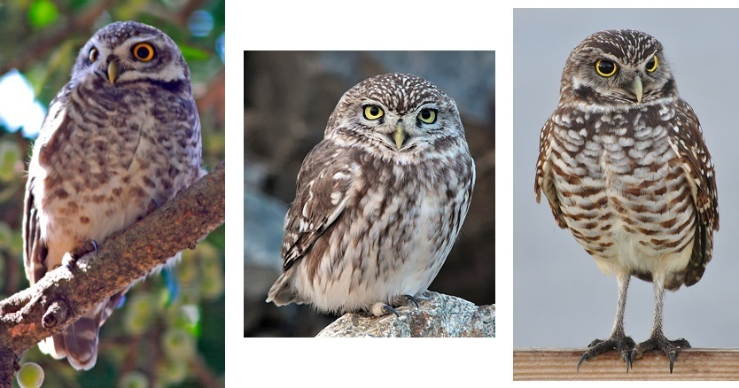

   从左到右依次为横斑腹小鸮、纵纹腹小鸮和穴鸮
   （图分别引自 `这里`__ 、 `这里`__ 和 `这里`__ ）

__ https://commons.wikimedia.org/wiki/File:Athene_brama.jpg

__ http://www.birdskoreablog.org/?p=10900

__ http://majikphil.blogspot.com/2011/02/florida-burrowing-owl.html

和鸺鹠相比，小鸮有很明显的像络腮胡子一样的白色领羽，
且白色的“眼圈”更为明显，由此可区分这两类猫头鹰。

通过头顶和腹部羽毛形成的图案，可以方便地区分这三种小鸮：
纵纹腹小鸮和穴鸮头顶为细小的纵斑，而横斑腹小鸮为点状斑；
横斑腹小鸮和穴鸮腹部为横斑，而纵纹腹小鸮腹部为纵纹。
此外，和另外两种小鸮相比，穴鸮是陆栖而非树栖，
快速奔跑的需求使得它们的腿较为细长且覆盖的毛通常较少；
最重要的是，穴鸮的产地不在中国。

小鸮以虫类和鼠类为主食；
若要饲养，建议以白鼠和虫类交替投喂。

其它
----

目前确定在我国有野生分布的小型猫头鹰还有鹰鸮和鬼鸮，
其中前者常见，后者罕见；
棕榈鬼鸮产于北美洲，在我国没有野生分布，
但因一张其被抚摸的图片（见《猫头鹰救助和饲养指南》）在互联网上流行，
故在本文档中一并介绍。
这三种猫头鹰的形态见附图，
其中鹰鸮、鬼鸮和棕榈鬼鸮的平均体长分别约为 30、25 和 20 厘米。

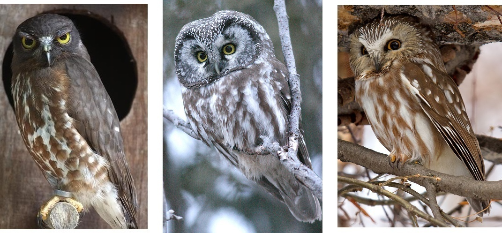

   从左到右依次为鹰鸮、鬼鸮和棕榈鬼鸮
   （图分别引自 `这里`__ 、 `这里`__ 和 `这里`__ ）

__ http://bobtheplainguy.blogspot.com/2009/01/penang-bird-park.html

__ https://en.wikipedia.org/wiki/File:Aegolius-funereus-001.jpg

__ http://ibc.lynxeds.com/photo/
   northern-saw-whet-owl-aegolius-acadicus/daytime-roost

鹰鸮的形态和其它各种猫头鹰有着明显的不同，故不再赘述。
鬼鸮和棕榈鬼鸮在形态上最大的区别在于鬼鸮面盘边缘明显有一圈深色的毛；
此外，鬼鸮的羽毛颜色总体比棕榈鬼鸮更深一些；
最重要的是，棕榈鬼鸮的产地不在中国。

鹰鸮以虫类、鼠类和小鸟为主食，建议以白鼠和虫类交替投喂。
鬼鸮在我国罕见，发现后请尽量及时联系有关社会力量，以进行专业救助。

中型猫头鹰
==========

耳鸮属
------

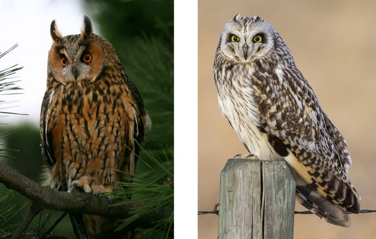

   左、右分别为长耳鸮和短耳鸮（图分别引自 `这里`__ 和 `这里`__ ）

__ http://tieba.baidu.com/p/2135199592

__ http://www.birdscalgary.com/2013/03/06/wednesday-wings-short-eared-owls/

林鸮属
------

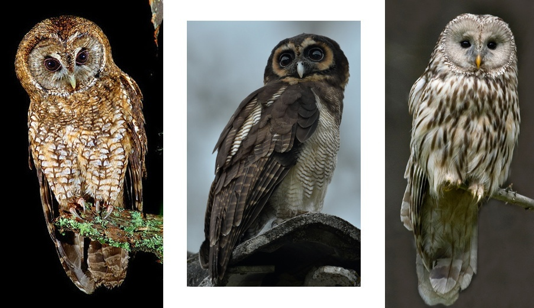

   从左到右依次为灰林鸮、褐林鸮和长尾林鸮
   （原图分别引自 `这里`__ 、 `这里`__ 和 `这里`__ ）

__ http://tieba.baidu.com/p/2135199592

__ https://secure.flickr.com/photos/zakirhassan/8121975074/

__ http://birds.nature4stock.com/?page_id=1803

猛鸮属
------

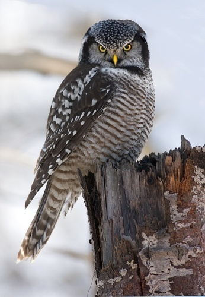

  猛鸮（图引自 `这里`__ ）

__ http://www.owlpages.com/image.php?image=species-Surnia-ulula-15

大型猫头鹰
==========

雕鸮属
------

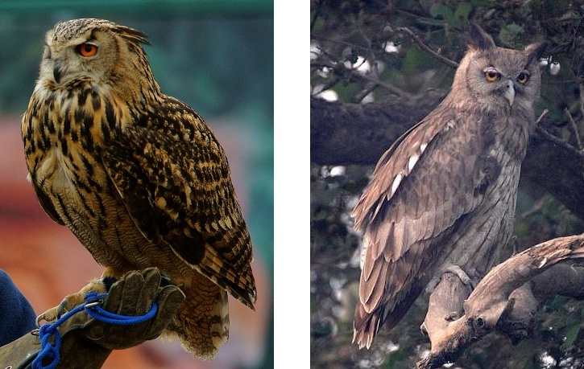

   左、右分别为雕鸮和乌雕鸮（原图分别引自 `这里`__ 和 `这里`__ ）

__ https://commons.wikimedia.org/wiki/
   File:Bubo_bubo_-British_Wildlife_Centre,_Surrey,_
   England_-zoo_keeper-8a_%281%29.jpg

__ http://orientalbirdimages.org/search.php?
   Bird_ID=624&Bird_Image_ID=49606&p=15

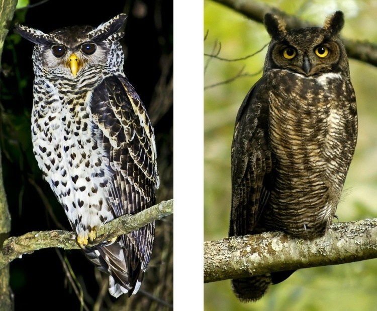

   左、右分别为林雕鸮和大角鸮（原图分别引自 `这里`__ 和 `这里`__ ）

__ http://tieba.baidu.com/p/2135199592

__ https://commons.wikimedia.org/wiki/
   File:Bubo_virginianus_-Reifel_Migratory_Bird_Sanctuary-8.jpg

渔鸮属
------

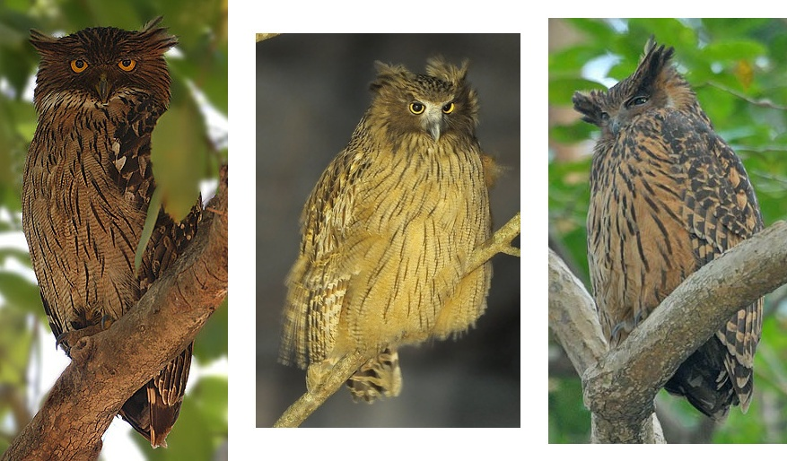

   从左到右依次为褐渔鸮、毛腿渔鸮和黄腿渔鸮
   （原图分别引自 `这里`__ 、 `这里`__ 和 `这里`__ ）

__ http://www.owlpages.com/image.php?image=species-Bubo-zeylonensis-1

__ http://lananhbirds.com/diendan/showthread.php?t=969

__ https://commons.wikimedia.org/wiki/File:Blakiston%60s_fish_owl1.jpg

其它
----

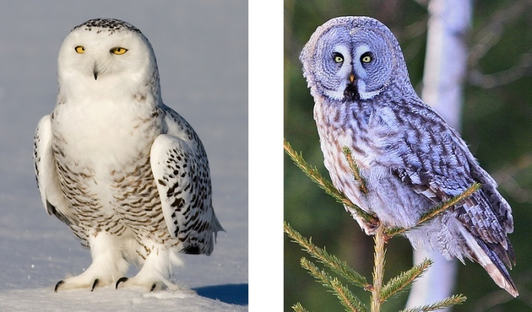

   左、右分别为雪鸮和乌林鸮（原图分别引自 `这里`__ 和 `这里`__ ）

__ http://www.owlpages.com/image.php?image=species-Bubo-scandiacus-2

__ http://www.owlpages.com/image.php?image=species-Strix-nebulosa-16

其它分类方法
============

