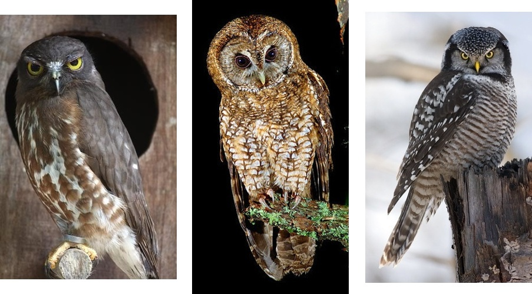
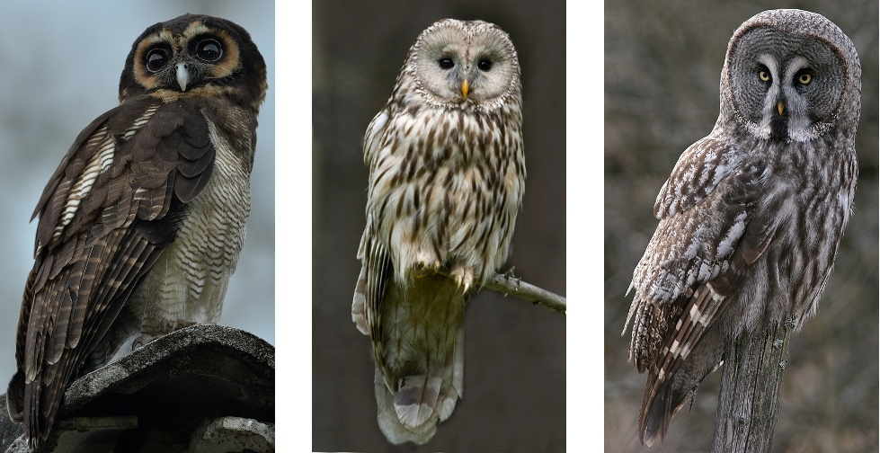

**************
猫头鹰分类指南
**************

:author: 百度猫头鹰吧[#baidu-owl]_
:date: 2016/10/15，v0.1.1

.. [#baidu-owl]
   http://tieba.baidu.com/f?ie=utf-8&kw=%E7%8C%AB%E5%A4%B4%E9%B9%B0

前言
====

简介
----

本文档旨在为中国的受众提供一个关于猫头鹰分类的、
以简洁和便于自助为目标的入门指南。

考虑到本文档的入门性质，本文档着重介绍生活中常见或著名的猫头鹰物种。
考虑到受众的范围，本文档主要介绍国内的猫头鹰物种，
但也介绍一些经常被提及和问到的非本土物种。

本文档源自百度猫头鹰吧网友的共同努力。
欢迎转载， *转载时请注明作者、出处* 。

本文档托管于 GitLab 上[#gitlab-link]_。

.. [#gitlab-link]
   https://gitlab.com/CasperVector/owl-guide

分类概况
--------

.. raw:: latex

   \begingroup
   \renewcommand{\emph}[1]{\textit{#1}}

本文档中的物种分法主要参考维基百科、
百度百科和《中国鸟类野外手册》[#cn-bird-guide]_。

.. [#cn-bird-guide]
   http://www.cnbird.org.cn/shouce/c.asp.htm

在生物分类学中，
猛禽类包括隼形目（鹰类）和鸮形目（广义的猫头鹰）的鸟类，
而鸮形目动物包括鸱鸮科（狭义的猫头鹰）和草鸮科（猴面鹰）两类。

猫头鹰在全世界范围内大约[#approx-species]_有 140 种，
其中在我国大约有 30 种（斜体西文为分类单位的拉丁文名）：

.. [#approx-species]
   种类数量的不确定性主要来源于物种分类和分布的相对模糊性。

- **草鸮科 *Tytonidae* ：**

  * **草鸮属 *Tyto* ：**
    草鸮 *Tyto longimembris* ，仓鸮 *Tyto alba* 。

  * **栗鸮属 *Phodilus* ：**
    栗鸮 *Phodilus badius* 。

- **鸱鸮科 *Strigidae* ：**

  * **角鸮属 *Otus* ：**
    东方角鸮 *Otus sunia* 、（西）红角鸮 *Otus scops* 、
    黄嘴角鸮 *Otus spilocephalus* 、领角鸮 *Otus bakkamoena* 、
    纵纹角鸮 *Otus brucei* 、琉球角鸮 *Otus elegans* 。

  * **鸺鹠属 *Glaucidium* ：**
    斑头鸺鹠 *Glaucidium cuculoides*  、花头鸺鹠 *Glaucidium passerinum* 、
    领鸺鹠 *Glaucidium brodiei* 。

  * **小鸮属 *Athene* ：**
    纵纹腹小鸮 *Athene noctua* 、横斑腹小鸮 *Athene brama* 。

  * **鬼鸮属 *Aegolius* ：**
    鬼鸮 *Aegolius funereus* 。

  * **耳鸮属 *Asio* ：**
    长耳鸮 *Asio otus* 、短耳鸮 *Asio flammeus* 。

  * **鹰鸮属 *Ninox* ：**
    鹰鸮 *Ninox scutulata* 。

  * **猛鸮属 *Surnia* ：**
    猛鸮 *Surnia ulula* 。

  * **林鸮属 *Strix* ：**
    灰林鸮 *Strix aluco* 、褐林鸮 *Strix leptogrammica* 、
    长尾林鸮 *Strix uralensis* 、四川林鸮 *Strix davidi* 、
    乌林鸮 *Strix nebulosa* 。

  * **雕鸮属 *Bubo* ：**
    雕鸮 *Bubo bubo* 、乌雕鸮 *Bubo coromandus* 、林雕鸮 *Bubo nipalensis* 。

  * **雪鸮属 *Nyctea* （现已并入雕鸮属）：**
    雪鸮 *Bubo scandiacus* 。

  * **渔鸮属 *Ketupa* （现已并入雕鸮属）：**
    褐渔鸮 *Bubo zeylonensis* 、
    黄脚渔鸮 *Bubo flavipes* 、
    毛腿渔鸮 *Bubo blakistoni* 。

本文档将顺带介绍一些经常被提及和问到的非本土物种：

- **鸱鸮科 *Strigidae* ：**

  * **白脸鸮属 *Ptilopsis* ：**
    （北）白脸角鸮 *Ptilopsis leucotis* 、南白脸角鸮 *Ptilopsis granti* 。

  * **小鸮属 *Athene* ：**
    穴（小）鸮 *Athene cunicularia* 。

  * **鬼鸮属 *Aegolius* ：**
    棕榈鬼鸮 *Aegolius acadicus* 。

  * **雕鸮属 *Bubo* ：**
    大角鸮 *Bubo virginianus* 。

.. raw:: latex

   \endgroup

分类方法概述
------------

因为是入门文档，
所以本文档采用较为符合非专业人士直觉的方式介绍分类的方法。
对于从照片中便可明显分辨的不同猫头鹰物种的形态区别不再进行阐述，
同时避免过多使用专有名词。

本文档将首先通过体型对猫头鹰进行一个粗浅的分类，
然后将每种体型的猫头鹰按形态分成若干类，
最后对各类中不同物种的具体区别进行介绍。

每种猫头鹰的雏鸟、幼鸟和成鸟的形态之间可能有巨大的差别。
因为是入门文档，且文档作者经验有限，
所以本文档只介绍成年猫头鹰的分类。

最后，作为最基本的进阶内容，
本文档也会提到通过一些非形态学的依据，
例如叫声、分布范围和繁殖期等判断分类的方法作为参考。

关于喂食
--------

关于喂食的主要事项，
请见《猫头鹰救助和饲养指南》；
具体到物种的一些细节事项，
本文档将在介绍相关物种时提到。

值得注意的细节
--------------

猫头鹰在觉得安全遇到威胁时，可能表现出不同于平时的形态（见附图）：
有耳状羽的猫头鹰在防御状态下普遍会竖起耳状羽，
特别是角鸮类同时还会有其它的一些比较明显的形态变化。
这些变化在一定程度上可能干扰对猫头鹰种类的判断，
因此需要提请注意。

   左、右分别为正常状态和防御状态下的东方角鸮（原图引自 `这里`__ ）

__ http://tieba.baidu.com/p/2724153583

如果给动物摄影时使用了闪光灯，那么在一定情况下可能发生“红眼”现象（见附图），
其原因是动物眼珠对灯光的折射。
给猫头鹰照相时同样可能发生这种现象，因此在观察照片时要注意辨别。

.. figure:: img/taxon/red-eye.jpg

   摄影时的“红眼”现象（图引自 `这里`__ ）

__ http://tieba.baidu.com/p/2941887428

小型猫头鹰
==========

角鸮类
------

常见种类
........

目前确定在我国有野生分布的角鸮中，
最常见的有领角鸮、东方角鸮和黄嘴角鸮（见附图），
其中领角鸮的平均体长约为 25 厘米，
而东方角鸮和黄嘴角鸮的平均体长约为 18 厘米。

   从左到右依次为领角鸮、东方角鸮和黄嘴角鸮
   （原图分别引自 `这里`__ 、 `这里`__ 和 `这里`__ ）

__ http://www.aerien.ch/oiseaux/Asie/STRIGIFORMES/STRIGIDAE/Otus_bakkamoena.php
__ http://www.birdnet.cn/thread-739470-1-1.html
__ http://tieba.baidu.com/p/2731146972

领角鸮的虹膜（即“眼白”，下同）为红色到深褐色（由此和东方角鸮、黄嘴角鸮区分），
喙（即嘴，下同）为带蜡状质感的黄色和/或深灰色。
其胸腹部有较为明显的纵纹，面部羽毛颜色和胸腹部相近，
后颈有浅色的“领”状羽（这是其中文名的来源）。

东方角鸮的虹膜为黄色，
喙为类似于焦炭一样质感的深灰色到黑色（由此和黄嘴角鸮区分）。
其胸腹部也有纵纹，但羽毛的整体颜色比领角鸮的更深；
面部羽毛的颜色、图案和背部相近。
东方角鸮分两种色型：灰色型和棕色型。

黄嘴角鸮的虹膜为黄色，喙为黄色。
其瞳孔较小，因此“表情”显得较为“呆滞”。
其胸腹部图案是较为细密的横纹。

东方角鸮和黄嘴角鸮在人工饲养条件下的食性比较奇怪：
它们中有一些只吃虫类，还有一些只吃鸡鸭肉，
当然也有一些虫类、鸡鸭肉等都吃。
因此，在喂食时，可以尝试投喂多种食物。

其它种类
........

西红角鸮、琉球角鸮（又名兰屿角鸮）形态和东方角鸮非常相似，但叫声不同。
多数生物学家将琉球角鸮作为西红角鸮的亚种，
同时也有不少生物学家建议将东方角鸮作为西红角鸮的亚种。
纵纹角鸮（见附图）在我国很罕见，外形和东方角鸮也很相似。

顺便提到，对不同的生物学家而言，
“红角鸮”这个名称可能指东方角鸮、西红角鸮或两者皆是，
因此具有较大的歧义，本文档不主张采用。

白脸鸮属的白脸角鸮（见附图）产于非洲，在中国没有野生分布，
但因在互联网上走红而颇有知名度。
近来有生物学家将白脸角鸮分为北白脸角鸮和南白脸角鸮两个物种。

   左、右分别为白脸角鸮和纵纹角鸮（图分别引自 `这里`__ 和 `这里`__ ）

__ https://en.wikipedia.org/wiki/File:Northern_white-faced_owl_arp.jpg
__ http://wowturkey.com/forum/viewtopic.php?t=32800

鸺鹠属和小鸮属
--------------

鸺鹠属
......

目前确定在我国有野生分布的鸺鹠有斑头鸺鹠、花头鸺鹠和领鸺鹠（见两附图），
其平均体长分别约为 24、18 和 16 厘米，领鸺鹠是我国体型最小的猫头鹰。

   左、右分别为斑头鸺鹠和花头鸺鹠（原图分别引自 `这里`__ 和 `这里`__ ）

__ http://tieba.baidu.com/p/694809590
__ http://www.pbase.com/breider/image/135508661

   领鸺鹠及其头部背面的 V 字图案（图引自 `这里`__ ）

__ http://orientalbirdimages.org/search.php?Bird_ID=635&Bird_Image_ID=92674

通过头顶和背部羽毛形成的图案，可以方便地区分这三种鸺鹠：
斑头鸺鹠的头顶和背部均为横纹，花头鸺鹠的头顶和背部均为点状斑；
领鸺鹠的头顶为点状斑，背部为横纹，且头部的背面有明显的 V 字形图案（见附图）。
以上方法只适用于完全成年的鸺鹠，
因为鸺鹠幼鸟的羽毛图案在发育的过程中会发生一些明显的改变。

鸺鹠昼夜均可能活动，具体活动时间取决于实际情况。
在我国，斑头鸺鹠常见，领鸺鹠较为常见。
*花头鸺鹠在我国罕见，发现后请尽量及时联系有关社会力量，以进行专业救助。*

小鸮属
......

目前确定在我国有野生分布的小鸮有纵纹腹小鸮和横斑腹小鸮；
穴鸮产于美洲，在我国没有野生分布，
但因其图片在互联网上流行，故在本文档中一并介绍。
这三种小鸮的形态见附图，
其中纵纹腹小鸮和穴鸮的平均体长约为 23 厘米，
而横斑腹小鸮的平均体长约为 20 厘米。

.. figure:: img/taxon/athene.jpg

   从左到右依次为横斑腹小鸮、纵纹腹小鸮和穴鸮
   （原图分别引自 `这里`__ 、 `这里`__ 和 `这里`__ ）

__ https://commons.wikimedia.org/wiki/File:Athene_brama.jpg
__ http://www.birdskoreablog.org/?p=10900
__ http://majikphil.blogspot.com/2011/02/florida-burrowing-owl.html

和鸺鹠相比，小鸮有很明显的像络腮胡子一样的白色领羽，
且白色的“眼圈”更为明显，由此可区分这两类猫头鹰。

通过头顶和胸腹部羽毛形成的图案，可以方便地区分这三种小鸮：
纵纹腹小鸮和穴鸮头顶为细小的纵斑，而横斑腹小鸮为点状斑；
横斑腹小鸮和穴鸮胸腹部为横斑，而纵纹腹小鸮胸腹部为纵纹。
此外，和其它往往住在树洞、岩洞等地的猫头鹰相比，
穴鸮是住在地洞里的（而其也由此得名），
快速奔跑的需求是它们的腿较为细长且覆盖的毛通常较少。
最重要的是，穴鸮的产地不在中国。

小鸮昼夜均可能活动，具体活动时间取决于实际情况。
纵纹腹小鸮在我国常见；而 *横斑腹小鸮在我国罕见，
因此发现后请尽量及时联系有关社会力量，以进行专业救助* 。

鬼鸮属
------

目前确定在我国有野生分布的小型猫头鹰还有鬼鸮；
棕榈鬼鸮产于北美洲，在我国没有野生分布，
但因一张其被抚摸的图片（见《猫头鹰救助和饲养指南》）在互联网上流行，
故在本文档中一并介绍。
鬼鸮和棕榈鬼鸮的形态见附图，
其平均体长分别约为 25 和 20 厘米。

   左、右分别为鬼鸮和棕榈鬼鸮（原图分别引自 `这里`__ 和 `这里`__ ）

__ https://en.wikipedia.org/wiki/File:Aegolius-funereus-001.jpg

__ http://ibc.lynxeds.com/photo/
   northern-saw-whet-owl-aegolius-acadicus/daytime-roost

鬼鸮和棕榈鬼鸮在形态上最大的区别在于鬼鸮面盘边缘明显有一圈深色的毛；
此外，鬼鸮的羽毛颜色总体比棕榈鬼鸮更深一些；
最重要的是，棕榈鬼鸮的产地不在中国。

*鬼鸮在我国罕见，发现后请尽量及时联系有关社会力量，以进行专业救助。*

中型猫头鹰
==========

猴面鹰
------

目前确定在我国有野生分布的草鸮科猫头鹰（即猴面鹰）
有草鸮、仓鸮和栗鸮（见附图），
其中草鸮和仓鸮的平均体长约为 35 厘米，
而栗鸮的平均体长约为 27 厘米。

   从左到右依次为草鸮、仓鸮和栗鸮
   （图分别引自 `这里`__ 、 `这里`__ 和 `这里`__ ）

__ http://25.media.tumblr.com/742e0fefb0b25f25070c442cfc39a881/
   tumblr_mi2di24FAD1qigj88o1_1280.jpg

__ https://en.wikipedia.org/wiki/
   File:Tyto_alba_-British_Wildlife_Centre,_Surrey,_England-8a_%281%29.jpg

__ http://ibc.lynxeds.com/photo/
   oriental-bay-owl-phodilus-badius/two-birds-perched-trunk-night

栗鸮的形态和另外两种猴面鹰有着明显的不同，故不再赘述。
草鸮和仓鸮在形态上最大的区别在于两者从背部到头顶羽毛的颜色：
草鸮是黑底色带黄色图案，黑色是主要的；仓鸮是橙底色带黑色图案，橙色是主要的。

仓鸮经常住在谷仓等地，以方便捕食鼠类，而其也由此得名。
草鸮和仓鸮主要以鼠类为食；若要饲养，建议以喂大/小白鼠为主。
草鸮在我国常见。
*在我国，仓鸮较为少见，而栗鸮更是罕见，
因此发现后请尽量及时联系有关社会力量，以进行专业救助。*

耳鸮属
------

目前确定在我国有野生分布的耳鸮有长耳鸮和短耳鸮（见附图），
两者平均体长均约为 37 厘米。

.. figure:: img/taxon/asio.jpg

   左、右分别为长耳鸮和短耳鸮（原图分别引自 `这里`__ 和 `这里`__ ）

__ http://tieba.baidu.com/p/2135199592
__ http://www.birdscalgary.com/2013/03/06/wednesday-wings-short-eared-owls/

长耳鸮和短耳鸮很容易区分，
其在形态上最大的区别在于短耳鸮具有明显的“黑眼圈”，而长耳鸮几乎没有。

长耳鸮和短耳鸮在我国均常见。

其它
----

目前确定在我国有野生分布的中型猫头鹰还有鹰鸮、灰林鸮和猛鸮，
其平均体长分别约为 30、43 和 38 厘米。

  从左到右依次为鹰鸮、灰林鸮和猛鸮
  （原图分别引自 `这里`__  、 `这里`__ 和 `这里`__）

__ http://bobtheplainguy.blogspot.com/2009/01/penang-bird-park.html
__ http://tieba.baidu.com/p/2135199592
__ http://www.owlpages.com/image.php?image=species-Surnia-ulula-15

在我国，鹰鸮常见，灰林鸮较常见。
*猛鸮在我国罕见，发现后请尽量及时联系有关社会力量，以进行专业救助。*

大型猫头鹰
==========

林鸮属
------

目前确定在我国有野生分布的林鸮有灰林鸮、褐林鸮、长尾林鸮、四川林鸮和乌林鸮。
灰林鸮是中型猫头鹰，上文中已介绍，此处不再赘述。
四川林鸮形态和长尾林鸮非常相似，只是前者分布在东北，后者分布在四川，
因此有生物学家将其作为长尾林鸮的亚种。
褐林鸮、长尾林鸮和乌林鸮的形态见附图，
其平均体长分别为 50、54 和 65 厘米。

   从左到右依次为褐林鸮、长尾林鸮和乌林鸮
   （原图分别引自 `这里`__ 、 `这里`__ 和 `这里`__ ）

__ https://secure.flickr.com/photos/zakirhassan/8121975074/
__ http://birds.nature4stock.com/?page_id=1803
__ http://www.wildsweden.com/news/great-grey-owl-season/

*在我国，褐林鸮和长尾林鸮数量较为稀少，而乌林鸮更是非常罕见，
因此发现后请尽量及时联系有关社会力量，以进行专业救助。*

雕鸮属
------

目前确定在我国有野生分布的雕鸮属猫头鹰有雕鸮、乌雕鸮和林雕鸮；
大角鸮产于美洲，在我国没有野生分布，
但因在各种海报和影像资料中经常出现而较为知名。
雕鸮、乌雕鸮、林雕鸮和大角鸮的形态见两附图，
其平均体长分别约为 69、56、63 和 55 厘米，
雕鸮是我国体型最大的猫头鹰。

   左、右分别为雕鸮和乌雕鸮（原图分别引自 `这里`__ 和 `这里`__ ）

__ https://commons.wikimedia.org/wiki/
   File:Bubo_bubo_-British_Wildlife_Centre,_Surrey,_
   England_-zoo_keeper-8a_%281%29.jpg

__ http://orientalbirdimages.org/search.php?
   Bird_ID=624&Bird_Image_ID=49606&p=15

.. figure:: img/taxon/nipalensis-virginianus.jpg

   左、右分别为林雕鸮和大角鸮（原图分别引自 `这里`__ 和 `这里`__ ）

__ http://tieba.baidu.com/p/2135199592

__ https://commons.wikimedia.org/wiki/
   File:Bubo_virginianus_-Reifel_Migratory_Bird_Sanctuary-8.jpg

雕鸮和乌雕鸮的形态比较相近，两者在形态上最大的区别在于羽毛的颜色：
雕鸮整体而言是黄色底带黑色图案；
乌雕鸮整体而言是胸腹部浅灰褐色，背部深灰褐色。

在不知道实物体型时，容易将雕鸮和长耳鸮混淆，
而事实上两者在形态上最大的区别在于面盘：
长耳鸮面盘为圆形，且眼睛靠近“眉毛”和“鼻梁”的一侧有轻微的“黑眼圈”；
雕鸮面盘为椭圆形，且眼睛没有任何“黑眼圈”。

雕鸮昼夜均可能活动，具体活动时间取决于实际情况。
*在我国，雕鸮数量较为稀少，且饲养成本很高、花费精力很多；
而乌雕鸮和林雕鸮更是罕见。
因此发现这些猫头鹰后请尽量及时联系有关社会力量，以进行专业救助。*

顺便提到，大角鸮不是一种角鸮。
“大角鸮”是“Great Horned Owl”的直译，
而角鸮属的角鸮被称为“Scops Owl”（例如东方角鸮 Oriental Scops Owl），
“Horned”和“Scops”的区别也说明了两者的意义并不相同。

渔鸮属
------

目前确定在我国有野生分布的渔鸮有褐渔鸮、黄脚渔鸮和毛腿渔鸮，
其平均体长分别约为 53、61 和 70 厘米。

   从左到右依次为褐渔鸮、毛腿渔鸮和黄脚渔鸮
   （原图分别引自 `这里`__ 、 `这里`__ 和 `这里`__ ）

__ http://www.owlpages.com/image.php?image=species-Bubo-zeylonensis-1
__ http://lananhbirds.com/diendan/showthread.php?t=969
__ https://commons.wikimedia.org/wiki/File:Blakiston%60s_fish_owl1.jpg

渔鸮和雕鸮的最大区别在于耳状羽的形状和胸腹部的羽毛图案：
雕鸮的耳状羽较为集中，是“一条”，
而渔鸮的耳状羽较为弥散，是“一束”；
雕鸮从胸到腹的纵纹是由粗变细，
而渔鸮的胸腹部纵纹或者都较粗，或者都较细。

通过腿上是否有羽毛以及胸腹部的羽毛图案可以区分这三种渔鸮：
毛腿渔鸮腿上有羽毛，而褐渔鸮和黄脚渔鸮腿上无羽毛；
褐渔鸮和毛腿渔鸮胸腹部为较细的纵纹，且每道纵纹均延伸出更细的横纹，
而黄脚渔鸮胸腹部为较粗的纵纹，且没有横纹。

*渔鸮在我国罕见，发现后请尽量及时联系有关社会力量，以进行专业救助。*

雪鸮
----

目前确定在我国有野生分布的大型猫头鹰还有雪鸮（见附图），
其平均体长约为 61 厘米。

   雪鸮（图引自 `这里`__ ）

__ http://www.owlpages.com/image.php?image=species-Bubo-scandiacus-2

通过羽毛所形成的图案很容易区分雪鸮的性别：
成年雄性雪鸮羽毛几乎全白；
而雌性或未成年雪鸮会有一些黑色的羽毛，形成斑状的图案。

雪鸮主要昼行。
*雪鸮在我国罕见，发现后请尽量及时联系有关社会力量，以进行专业救助。*

其它分类方法
============

为了方便初学者学习和掌握，
以上的形态学分类方法是较为精简的版本。
有志于更加深入了解的读者可以参考更加专业的资料，
例如《中国鸟类野外手册》：
http://www.cnbird.org.cn/shouce/c.asp.htm 。
这些资料中通常也会对鸟类的分布范围和繁殖期等进行介绍，
可以作为判断其分类的辅助参考。

尽管本文档没有涉及，但事实上鸟类的叫声是分类的重要依据，
而了解各种鸟类的叫声几乎是鸟类学家的必修课。
专业资料中往往会描述各种鸟类的叫声；
此外，互联网上也有许多鸟类叫声资源，
其中特别值得一看的是 xeno-canto 鸟类叫声数据库：
http://www.xeno-canto.org/ 。
该数据库类似于维基百科，
资料由网友上传，可以免费浏览和下载。

